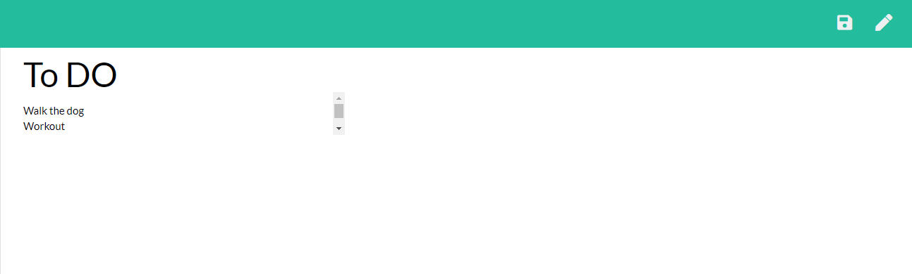

# Note-Taking-Genius

## Table of Contents

* [Description](#description)
* [License](#license)
* [Installation](#installation)
* [Use](#use)
* [Contributions](#contributions)
* [Testing](#testing)
* [Questions](#questions)

## Description
This project allows users to save their notes and store it in an API to recall later on. 

## License
[Full License Here](https://opensource.org/licenses/MIT).

## Installation
Run "npm install" and "npm install express --save". 

## Use
To use this project, run node server.js and open the local host on your web browser.

## Contributions
For future contributions push all changes to a separate branch and request the repository owner and a reviewer on all change requests.

## Testing
To test this project use the command "server.js" if any errors occur, you will be able to view it in the console log.

## Questions
Contact the following with any additional questions:
- Git Hub Profile: https://github.com/arianaw15
- Email: arianaw15@gmail.com

## Images
.
